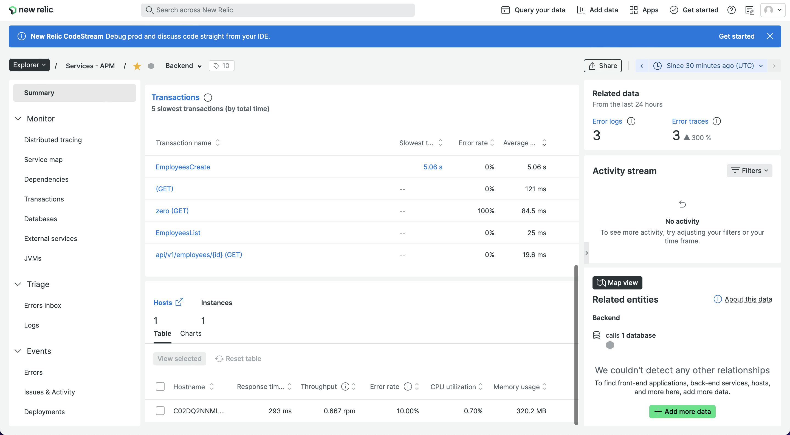

# Backend

This folder has the source code for running the app's backend.


---

## Contents

- [Backend](#backend)
  - [Contents](#contents)
  - [New Relic APM Integration](#new-relic-apm-integration)
    - [1. Add Dependencies](#1-add-dependencies)
    - [2. Unzip the packages](#2-unzip-the-packages)
    - [3. Setting New Relic configuration](#3-setting-new-relic-configuration)
    - [4. Adding the Java agent to JVM](#4-adding-the-java-agent-to-jvm)
  - [Custom Monitoring](#custom-monitoring)
  - [Available API Endpoints](#available-api-endpoints)
  - [Running the Code](#running-the-code)
  - [New Relic Dashboard](#new-relic-dashboard)
  - [Additional resources](#additional-resources)
    - [New Relic - Java monitoring](#new-relic---java-monitoring)

---

## New Relic APM Integration

Since we are using Maven, we will detail the integration process done for Maven. Gradle integration available [here](https://docs.newrelic.com/docs/apm/agents/java-agent/additional-installation/install-java-agent-using-gradle)

### 1. Add Dependencies

1. New Relic Java agent: This agent monitor the whole application. we will start by adding the dependency to `pom-xml`. Replace `JAVA_AGENT_VERSION` with the [latest Java agent version](https://docs.newrelic.com/docs/agents/java-agent/getting-started/java-release-notes).

```xml
    <dependency>
        <groupId>com.newrelic.agent.java</groupId>
        <artifactId>newrelic-java</artifactId>
        <version>JAVA_AGENT_VERSION</version>
        <scope>provided</scope>
        <type>zip</type>
    </dependency>
```

2. New Relic Java API: This dependencies allows to introduce custom monitoring with trace annotations. we will add it to `pom-xml` similar to the agent.

```xml
    <dependency>
        <groupId>com.newrelic.agent.java</groupId>
        <artifactId>newrelic-api</artifactId>
        <version>7.9.0</version>
    </dependency>
```

### 2. Unzip the packages

Unzip `newrelic-java.zip` by configuring `maven-dependency-plugin` in your `pom.xml` in `build.plugions`:

```xml
<plugin>
    <groupId>org.apache.maven.plugins</groupId>
    <artifactId>maven-dependency-plugin</artifactId>
    <version>3.1.1</version>
    <executions>
        <execution>
            <id>unpack-newrelic</id>
            <phase>package</phase>
            <goals>
                <goal>unpack-dependencies</goal>
            </goals>
            <configuration>
                <includeGroupIds>com.newrelic.agent.java</includeGroupIds>
                <includeArtifactIds>newrelic-java</includeArtifactIds>
                <!-- you can optionally exclude files -->
                <!-- <excludes>**/newrelic.yml</excludes> -->
                <overWriteReleases>false</overWriteReleases>
                <overWriteSnapshots>false</overWriteSnapshots>
                <overWriteIfNewer>true</overWriteIfNewer>
                <outputDirectory>${project.build.directory}</outputDirectory>
            </configuration>
        </execution>
    </executions>
</plugin>
```

### 3. Setting New Relic configuration

- Place `newrelic.yml` in the same folder as newrelic.jar in our case in `target/newrelic`, if you want to change it, you can specify otherwise in the JVM arg Dnewrelic.config.file.
- Configure the `newrelic.yml` file (or JVM system properties) with your `license_key` and `app_name` and your other parameters.

### 4. Adding the Java agent to JVM

You have to pass `-javaagent:/path/to/newrelic.jar` to the JVM running your application server. In our case we used the `spring-boot-maven-plugin` plugin in `pom.xml` to pass it:

```xml
<plugin>
    <groupId>org.springframework.boot</groupId>
    <artifactId>spring-boot-maven-plugin</artifactId>
    <configuration>
        <agents>
            <agent>target/newrelic/newrelic.jar</agent>
        </agents>
    </configuration>
</plugin>
```

## Custom Monitoring

To monitor specific function inside the API we used the Trace annotation from New Relic API. For example, we created a custom metric named `MetricOne` for the function `asyncGreeting` that sleeps for 2 minutes:

```java
@Trace(metricName = "MetricOne", dispatcher = true, async = true)
public String asyncGreeting() {
    try {
        Thread.sleep(120000);
    } catch (InterruptedException e) {
        e.printStackTrace();
    }
    return "Async greetings from Spring Boot!";
}
```

## Available API Endpoints

| Path                   | Type     | Method | API Description                                                 | Custom Metric           |
| ---------------------- | -------- | ------ | --------------------------------------------------------------- | ----------------------- |
| /                      | Endpoint | GET    | Root Path sleeps for 100ms .                                    | NO                      |
| /hello                 | Endpoint | GET    | Endpoint that sleeps for 2 minutes                              | YES, MetricOne          |
| /zero                  | Endpoint | GET    | Endpoint that fail due to division by zero.                     | YES, FailDivisionByZero |
| /api/v1/employees      | Endpoint | GET    | Endpoint that lists all employees.                              | YES, EmployeesList      |
| /api/v1/employees      | Endpoint | POST   | Endpoint that create an employee and sleeps for 5s.             | YES, EmployeesCreate    |
| /api/v1/employees/{id} | Endpoint | GET    | Endpoint that returns an employee.                              | NO                      |
| /api/v1/employees/{id} | Endpoint | PUT    | Endpoint that update an employee.                               | NO                      |
| └─── update            | FUNCTION | -      | Function that update employee in Database.                      | YES, EmployeeUpdate     |
| /api/v1/employees/{id} | Endpoint | DELETE | Endpoint that delete an employee.                               | NO                      |
| └─── delete            | FUNCTION | -      | Function that delete employee from Database and sleeps for 30s. | YES, EmployeeDelete     |

## Running the Code

1. Create a database inside your MySQL/MariaDB named `employee_management_system`.
2. Go to `src/main/resources/application.properties` and edit your database connection parameters:

```
spring.datasource.url=jdbc:mysql://localhost:3306/employee_management_system?useSSL=false
spring.datasource.username=root
spring.datasource.password=admin
spring.jpa.properties.hibernate.dialect = org.hibernate.dialect.MySQL5InnoDBDialect
spring.jpa.hibernate.ddl-auto = update
```

3. We can now build and run the application by issuing the following command:

```sh
# MacOS/Linux:
./mvnw spring-boot:run

#Windows:
mvnw spring-boot:run
```

4. Backend available at `localhost:8080`


## New Relic Dashboard




## Additional resources

In this section, we provide some additional resources.

### New Relic - Java monitoring

Refer to [Java monitoring](https://docs.newrelic.com/docs/apm/agents/java-agent/getting-started/introduction-new-relic-java) for detailed instructions on New Relic integration in Java applications
